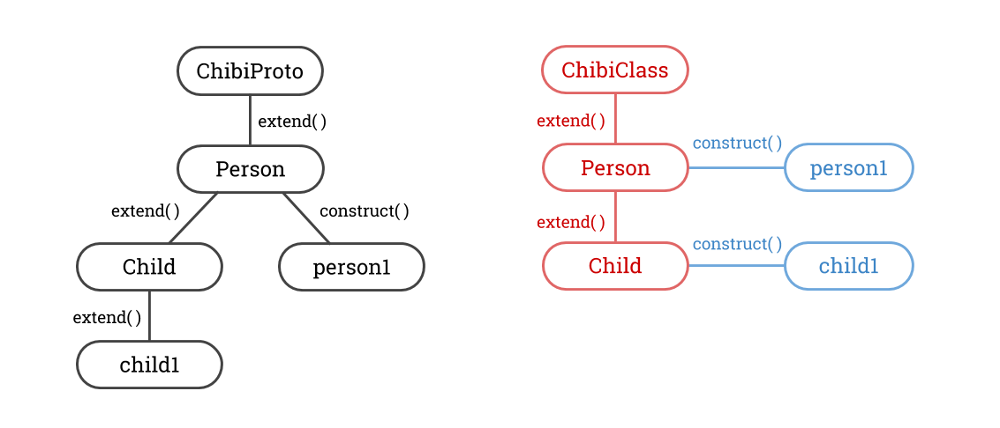

ChibiProto and ChibiClass
=========================

Two microscopic libraries for simpler subclassing in javascript. These are so small (~20 lines each) that I usually just copy them into my code instead of importing the entire file. Let's see how they work!

### ChibiProto

```js
var Person = ChibiProto.extend({
	constructor: function (name) {
		this.name = name;
	}
});

var Child = Person.extend({
	constructor: function (name, age) {
		Person.constructor.call(this, name);
		this.age = age;
	}
});

// you can manually modify the prototype too
Child.hello = function () {
	console.log('hello, my name is ' + this.name);
};

var person1 = Person.construct('bob');
var child1 = Child.construct('billy', 10);
```

### ChibiClass

```js
// notice that there is no ChibiClass.extend()!
var Person = ChibiClass({
	constructor: function (name) {
		this.name = name;
	}
});

var Child = Person.extend({
	constructor: function (name, age) {
		Person.constructor.call(this, name);
		this.age = age;
	}
});

// you can manually modify the prototype too
Child.prototype.hello = function () {
	console.log('hello, my name is ' + this.name);
};

Person.staticMethod = function () {
	console.log('static method are not inherited');
};

var person1 = Person.construct('bob');
var child1 = Child('billy', 10); // shorthand construction
```

### ChibiProto vs ChibiClass: Syntax Differences

* to define a base class, in ChibiProto use `ChibiProto.extend({ properties })`, in ChibiClass use `ChibiClass({ properties })`
* to manually modify the prototype, in ChibiProto use `MyProto.mymethod = ...`, in ChibiClass use `MyClass.prototype.mymethod = ...`
* ChibiClass can have static methods, defined using `MyClass.staticMethod = ...`
* ChibiClass has shorthand construction: `MyClass(args)` is equivalent to `MyClass.construct(args)`

If you want to know where these differences come from, keep reading!

### The Fundamental Difference

ChibiProto follows javascript's prototypal ideology, where classes and instances are the same thing, and any object can serve as a "prototype" for another object. Thus, `contruct` and `extend` both essentially do the same thing: create a new object with the old object as the prototype. The only difference is that `construct` calls created object's constructor, and `extend` adds extra properties to the created object. This also means that, while perhaps a little counter-intuitive, objects created through `construct` will also inherit the `construct` and `extend` methods.

ChibiClass follows the more traditional class ideology, where classes and instances are different entities. Classes are created through the `extend` method, and each class carries an internal `prototype` object. This object is then used during the `construct` method to create new instances. This is why in order to manually modify the prototype, for ChibiProto we use `MyProto.mymethod = ...`, whereas for ChibiClass we use `MyClass.prototype.mymethod = ...`. Another major consequence of these differences is that ChibiClass can have static methods, but ChibiProto can not. This is simply because in ChibiProto, the class itself is being used as the prototype, so every method has to get inherited.

To summarize, ChibiProto classes uses themselves as a prototype for constructing instances, whereas ChibiClass classes use an internal prototype to construct instances.


